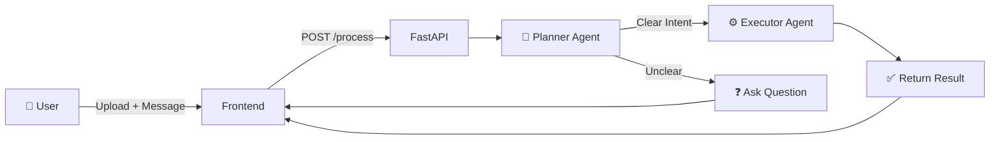
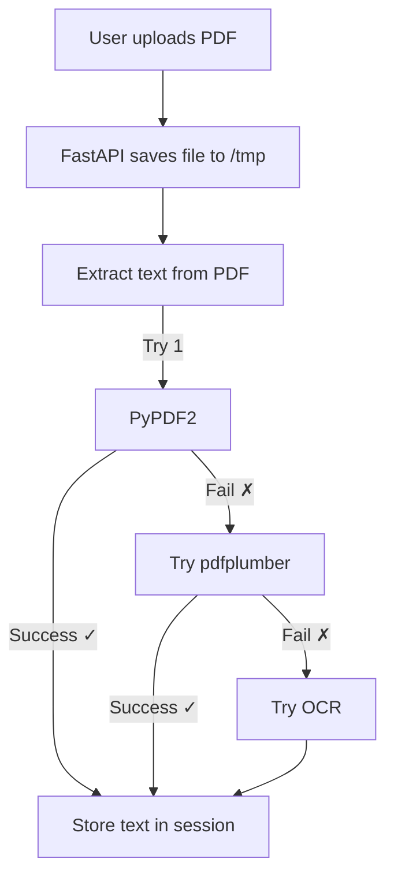
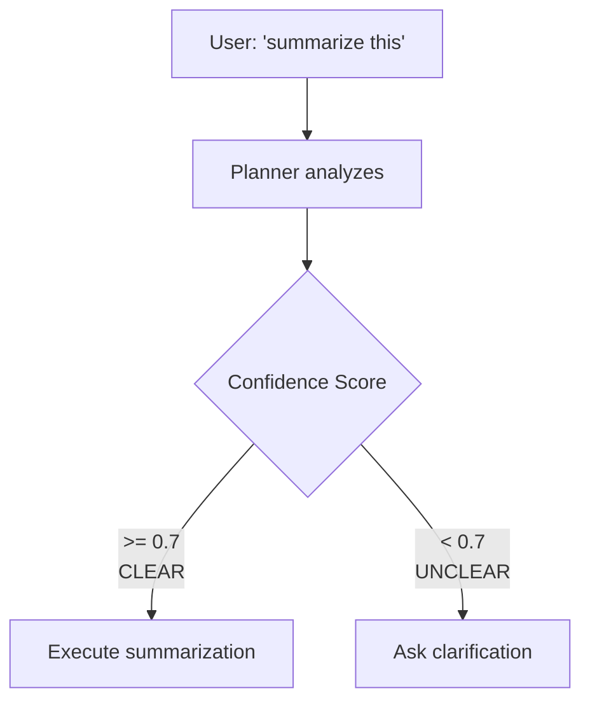
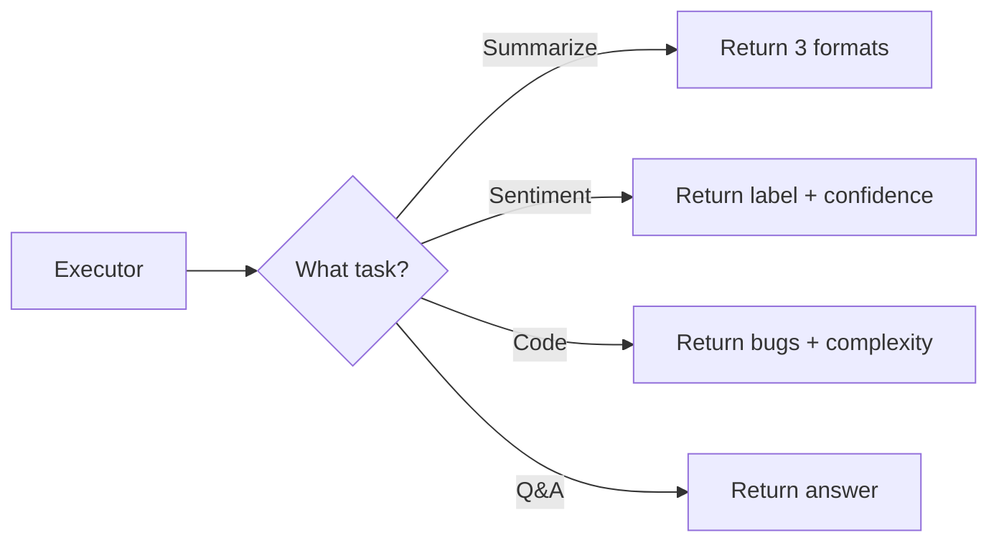
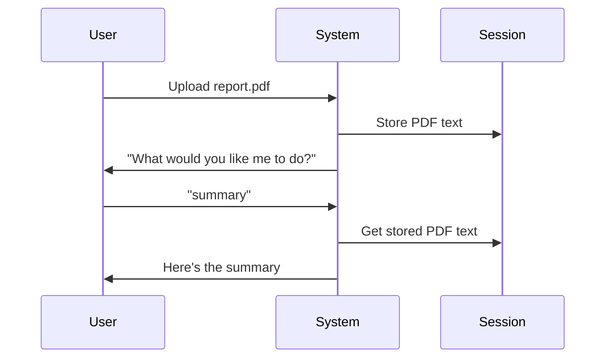
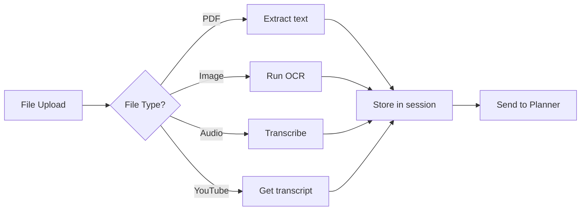
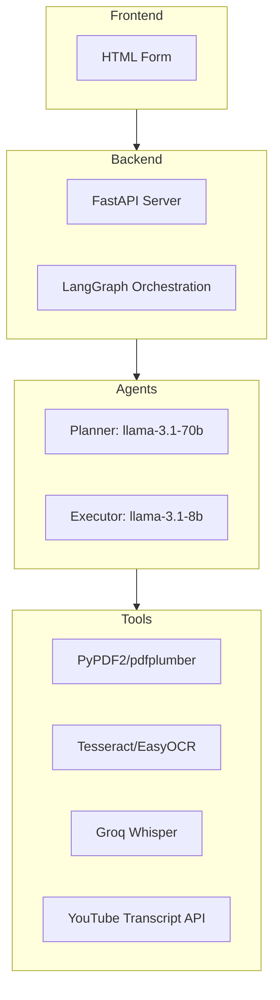

# 🏗️ Architecture Diagram

## System Overview

Simple flow: **User → Frontend → FastAPI → Agents → Response**



**Key Components:**
1. **Frontend** - Simple HTML form for file upload
2. **FastAPI** - Receives files, saves temporarily
3. **Planner Agent** - Understands what user wants (llama-3.1-70b)
4. **Executor Agent** - Does the actual task (llama-3.1-8b)

---

## How It Works (Step-by-Step)

### 1. User Uploads a File



**File Types Handled:**
- PDF → PyPDF2 → pdfplumber → OCR
- Images → Tesseract → EasyOCR
- Audio → Groq Whisper
- YouTube → Fetch transcript

---

### 2. Planner Decides What to Do



**Examples:**
- ✅ "summarize this" → Clear (confidence 0.9)
- ✅ "what's the sentiment?" → Clear (confidence 0.85)
- ❌ "do something" → Unclear (confidence 0.2) → Asks question

---

### 3. Executor Runs the Task



**All tasks use Groq LLM to generate structured JSON responses**

---

## Multi-Turn Conversations

How the system remembers context across messages:



**Session stores:**
- Extracted file content
- Conversation history
- Last intent

---

## File Processing Pipeline



---

## Technology Stack



---

## Why This Architecture?

### ✅ Two Separate Agents (Bonus Points)
- **Planner** - Smart, slow (70B model) - understands intent
- **Executor** - Fast, efficient (8B model) - does work

### ✅ LangGraph for Transparency
- Every request has execution trace
- Easy to debug
- Shows exactly what happened

### ✅ Session Persistence
- Remembers uploaded files
- Multi-turn conversations work
- No need to re-upload

### ✅ Graceful Fallbacks
- PDF fails? Try another tool
- OCR confidence low? Try EasyOCR
- LLM fails? Return helpful error

---

## Execution Trace Example

Every request shows what happened:

```json
{
  "trace": [
    "agent_start",
    "input_processing_start",
    "input_processing_complete_type_pdf",
    "planner_start",
    "planner_ready_to_execute_intent_summarization",
    "executor_start",
    "executor_success_task_summarization",
    "format_response_complete"
  ]
}
```

**This trace proves:**
1. PDF was processed successfully
2. Planner understood the intent (summarization)
3. Executor completed the task
4. Response was formatted correctly
