# 🏗️ Architecture Diagram

## System Architecture Overview

```mermaid
graph TB
    User[👤 User] -->|Text/File + Message| UI[🖥️ Frontend UI<br/>index.html]
    UI -->|POST /process| API[⚡ FastAPI Server<br/>src/api/main.py]
    
    API -->|Create AgentState| Graph[🔄 LangGraph Orchestrator<br/>agent_graph.py]
    
    Graph --> InputNode[📥 Input Processing Node]
    InputNode -->|Detect Type| Processor[🔍 Input Processor<br/>input_processor.py]
    
    Processor -->|PDF| PDFTool[📄 PDF Tool<br/>PyPDF2→pdfplumber→OCR]
    Processor -->|Image| OCRTool[🖼️ OCR Tool<br/>Tesseract→EasyOCR]
    Processor -->|Audio| AudioTool[🎵 Audio Tool<br/>Groq Whisper]
    Processor -->|YouTube| YTTool[▶️ YouTube Tool<br/>youtube-transcript-api]
    Processor -->|Text| TextProc[📝 Direct Text]
    
    PDFTool -->|Extracted Text| Session[(💾 Session Manager<br/>conversation_manager.py)]
    OCRTool -->|Extracted Text| Session
    AudioTool -->|Transcript| Session
    YTTool -->|Transcript| Session
    TextProc -->|Raw Text| Session
    
    InputNode -->|State + Content| PlannerNode[🧠 Planner Node]
    PlannerNode -->|Analyze Intent| Planner[🎯 Planner Agent<br/>llama-3.1-70b-versatile]
    
    Planner -->|Confidence < 0.7| Clarify{❓ Need<br/>Clarification?}
    Clarify -->|Yes| Response[📤 Return Clarification]
    Response --> UI
    
    Clarify -->|No| ExecutorNode[⚙️ Executor Node]
    ExecutorNode -->|Execute Task| Executor[🔨 Executor Agent<br/>llama-3.1-8b-instant]
    
    Executor -->|Summarization| SumTask[📊 Summarize<br/>3 Formats]
    Executor -->|Sentiment| SentTask[😊 Sentiment<br/>Label+Confidence]
    Executor -->|Code Explain| CodeTask[💻 Code Analysis<br/>Bugs+Complexity]
    Executor -->|Conversational| ConvTask[💬 Q&A Response]
    Executor -->|Audio Summary| AudioTask[🎧 Transcribe+Summarize]
    Executor -->|YouTube| YTTask[📹 Fetch+Summarize]
    Executor -->|Extract| ExtractTask[📋 Text Extraction]
    
    SumTask --> FormatNode[📝 Format Response Node]
    SentTask --> FormatNode
    CodeTask --> FormatNode
    ConvTask --> FormatNode
    AudioTask --> FormatNode
    YTTask --> FormatNode
    ExtractTask --> FormatNode
    
    FormatNode -->|Structured JSON| API
    API -->|Response| UI
    UI -->|Display Result| User
    
    style User fill:#e1f5ff
    style UI fill:#fff3cd
    style API fill:#d4edda
    style Graph fill:#f8d7da
    style Planner fill:#d1ecf1
    style Executor fill:#d1ecf1
    style Session fill:#e2e3e5
    style Clarify fill:#fff3cd
```



## Detailed Component Flow

### 1️⃣ Input Processing Flow


### 2️⃣ Planning & Decision Flow


### 3️⃣ Execution Flow


## State Management

### AgentState Schema


## LangGraph State Transitions


## Technology Stack Diagram


## File Upload & Processing Pipeline


## Clarification Flow Diagram


## Error Handling Flow


---

## Key Design Decisions

### 1. Multi-Agent Separation
- **Planner (llama-3.1-70b):** Better reasoning, intent analysis
- **Executor (llama-3.1-8b):** Faster execution, structured outputs
- **Why:** Separation of concerns, bonus points, better accuracy

### 2. LangGraph vs Custom Loop
- **Chosen:** LangGraph StateGraph
- **Why:** Explicit state transitions, built-in tracing, required for explainability scoring

### 3. In-Memory Session Storage
- **Chosen:** Python dict in memory
- **Why:** Simple, fast, sufficient for demo/assignment
- **Production:** Would use Redis/PostgreSQL

### 4. Three-Tier PDF Extraction
- **PyPDF2 → pdfplumber → OCR**
- **Why:** Maximizes success rate across different PDF types

### 5. Confidence-Based Clarification
- **Threshold:** 0.7
- **Why:** Balance between over-asking and wrong assumptions

---

## Execution Trace Example

Every request includes a trace showing the path through the system:

```json
{
  "trace": [
    "agent_start",
    "input_processing_start",
    "input_processing_complete_type_pdf",
    "planner_start",
    "planner_ready_to_execute_intent_summarization",
    "executor_start",
    "executor_success_task_summarization",
    "format_response_start",
    "format_response_complete"
  ]
}
```

This provides **explainability** required by the rubric.
